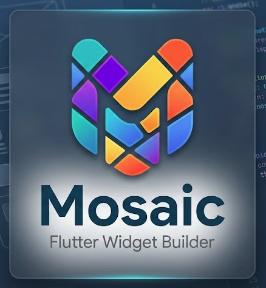

<p align="center">
  
</p>

<p align="center">
  <a href="https://github.com/TheBSD/StandWithPalestine/blob/main/docs/README.md"></a>
  <a href="https://pub.dev/packages/mosaic_widgets"></a>
  <a href="https://pub.dev/packages/mosaic_widgets/score"></a>
</p>

<p align="center"><b>Write a home-screen widget once in Dart. Ship it on iOS and Android.</b></p>

Mosaic turns a Flutter-style Dart tree into **real native widgets** — SwiftUI/WidgetKit
on iOS, RemoteViews/Kotlin on Android. Your app pushes data; the OS draws the tile.
No Swift, no Kotlin, no per-platform widget code.

```dart
import 'package:mosaic_widgets/dsl.dart';

MosaicDefinition buildNews() => MosaicDefinition(
  name: 'News',
  root: MContainer(
    background: const MColor.hex('#111827', dark: '#000000'),
    radius: 16,
    child: MPadding(
      const MInsets.all(12),
      MText(MBind('title'), style: const MTextStyle(bold: true)),
    ),
  ),
);
```

## Quick start

```yaml
# pubspec.yaml
dependencies:
  mosaic_widgets: ^0.3.0
```

```bash
dart run mosaic_widgets:mosaic init          # writes mosaic.yaml from your real bundle ids
dart run mosaic_widgets:mosaic add widget News
dart run mosaic_widgets:mosaic build         # generates the native code
dart run mosaic_widgets:mosaic doctor        # checks the native wiring
```

Then push data from your app:

```dart
import 'package:mosaic_widgets/mosaic_widgets.dart';

await MosaicBridge.setAppGroupId('group.com.example.app.widgets'); // iOS only
await MosaicBridge.saveString('title', 'Markets rally');
await MosaicBridge.refreshAll();
```

One-time native wiring (an Xcode Widget Extension target, one line in your
`AppDelegate` / `MainActivity`) is in [iOS Setup](docs/IOS_SETUP.md) and
[Android Setup](docs/ANDROID_SETUP.md). `doctor` tells you exactly what is missing.

## What you get

| | |
|---|---|
| **Home-screen widgets** | iOS 14+ WidgetKit · Android AppWidget |
| **Lock Screen** | iOS 16+ accessory families |
| **Live Activities** | Dynamic Island, and Apple Watch with `watch: true` |
| **Controls** | iOS 18 Control Center · Android Quick Settings tiles |
| **Interactive** | Buttons, toggles, deep links, background callbacks |
| **Live data** | `MBind` for text, images, progress, visibility, timers, colours |
| **Refresh with the app closed** | Declare an endpoint; the widget fetches it itself |
| **Per-size layouts** | `compactRoot:` gives small tiles their own tree |
| **Theming** | Light/dark, Material You (`MColor.system`), iOS tinted mode |
| **Device metrics** | Battery, storage and RAM, read in the widget process |
| **Render any Flutter widget** | `renderFlutterWidget` rasterises to a PNG for what the DSL cannot express |
| **Or drop to native** | `MRaw` inserts your own SwiftUI / layout XML, keeping the generated plumbing |
| **Per-platform trees** | `MAdaptive` when one tree genuinely cannot serve both |
| **Typography** | `MTextRole` semantic scale, `MFontWeight` w100–w900, `italic`, `copyWith` |
| **macOS & watchOS** | One extension target compiles for both, watch complications included |
| **Android TV** | Home-screen channels of preview cards — TV hosts no widgets at all |
| **Accessibility** | `MSemantics` → VoiceOver / TalkBack |
| **Localised text** | Real `values-<locale>/` and `.lproj` resources |

Widgets are static snapshots on both platforms, so there is **no general
animation and no Lottie**. What exists: a spinner and self-cycling content on
Android, digit-roll transitions on iOS 17+, and live timers on both — each
documented with its limits rather than failing quietly.

## Docs

**[DSL Reference](docs/DSL_REFERENCE.md)** — every node, with its platform notes
· **[iOS Setup](docs/IOS_SETUP.md)** · **[Android Setup](docs/ANDROID_SETUP.md)**
· **[Live Activities](docs/LIVE_ACTIVITIES.md)** · **[Roadmap](docs/ROADMAP.md)**

A runnable app using every feature lives in [`examples/demo_app`](examples/demo_app).

## Using an AI assistant?

Mosaic is newer than most training data, so it ships a skill that teaches
assistants the real API:

```bash
cp -r skills/mosaic-widgets ~/.claude/skills/
```

Assistants then load it automatically on seeing a `mosaic.yaml` or a
`*.widget.dart` file. See also [`llms.txt`](llms.txt) and [`AGENTS.md`](AGENTS.md).

## Support

If Mosaic helped you, consider supporting the author:

[](https://buymeacoffee.com/is10vmust)
